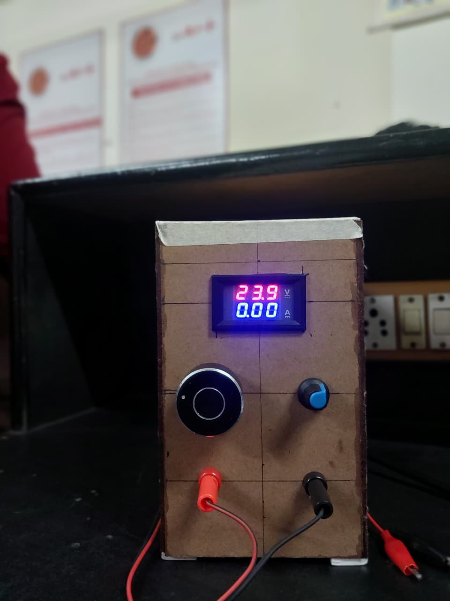
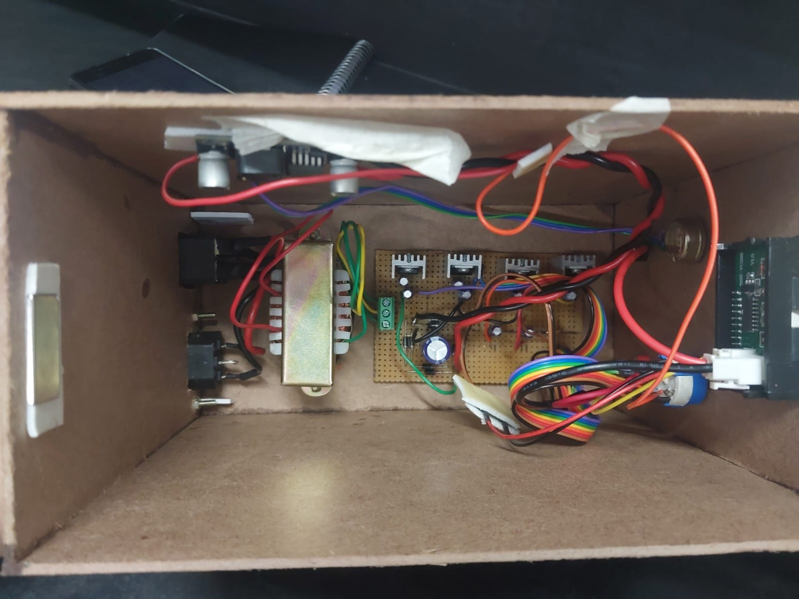
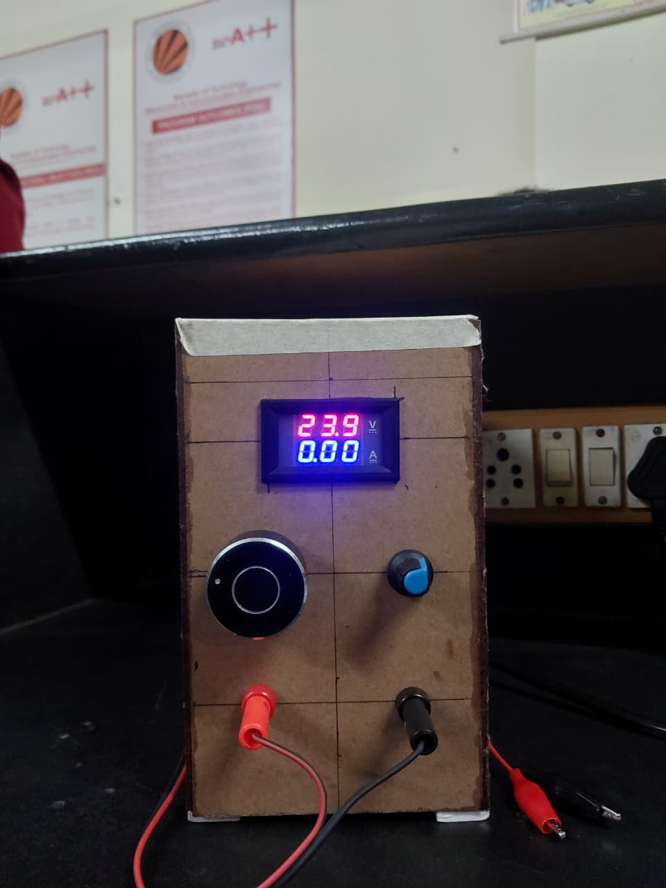
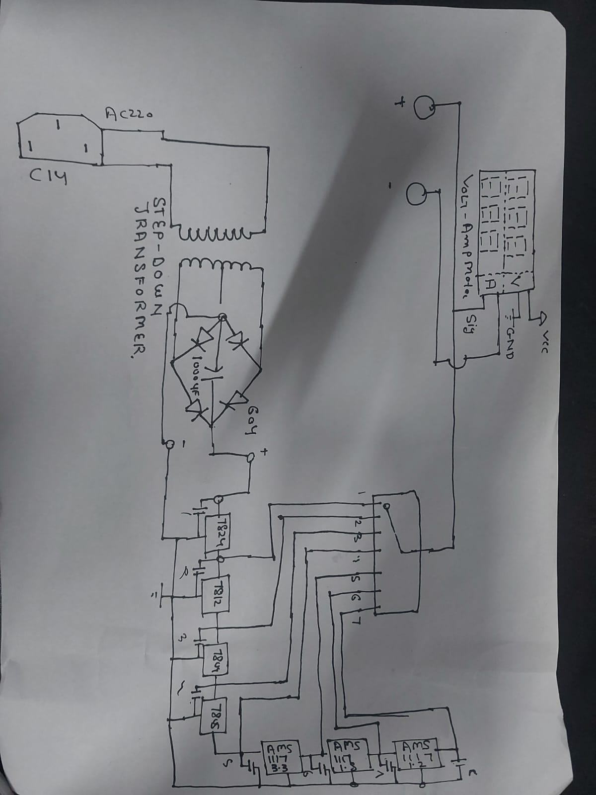

# Adjustable DC Power Supply

## Project Overview

This project is a regulated multi-output DC power supply designed to provide multiple fixed DC voltage levels from a single 220V AC input source. It is suitable for powering embedded systems, microcontrollers, sensors, and electronic circuits.

The circuit converts 220V AC into regulated DC outputs using a step-down transformer, bridge rectifier, filter capacitor, and voltage regulator ICs.

---

## Features

- Multiple regulated DC output voltages
- Stable voltage regulation
- Low ripple output
- Built-in Digital Voltmeter
- Built-in Ammeter
- Compact hardware design
- Suitable for laboratory and embedded applications

---

## Output Voltages

- 24V
- 12V
- 9V
- 5V
- 3.3V
- 1.5V
- 1.2V

---

## Components Used

- 220V AC to 24V Step Down Transformer
- Bridge Rectifier
- 1000µF Filter Capacitor
- IC 7824
- IC 7812
- IC 7809
- IC 7805
- AMS1117-3.3
- AMS1117-1.5
- AMS1117-1.2
- Digital Voltmeter & Ammeter
- Potentiometers
- Connecting Wires
- PCB / Veroboard

---

## Working Principle

1. 220V AC is stepped down to 24V AC using a transformer.
2. The bridge rectifier converts AC into pulsating DC.
3. The filter capacitor smooths the DC output.
4. Voltage regulator ICs generate different regulated output voltages.
5. The digital voltmeter and ammeter monitor the output voltage and current.

---

## Applications

- Embedded Systems
- Arduino Projects
- ESP32 Projects
- STM32 Development
- Electronics Laboratory
- Sensor Testing
- Breadboard Prototyping

---

## Project Images

### Front View

### Internal Wiring

### Display

### Circuit Diagram

---

## Future Improvements

- Variable voltage output using LM317
- Current limiting protection
- Short circuit protection
- USB Type-C Output
- Cooling Fan
- LCD Display
